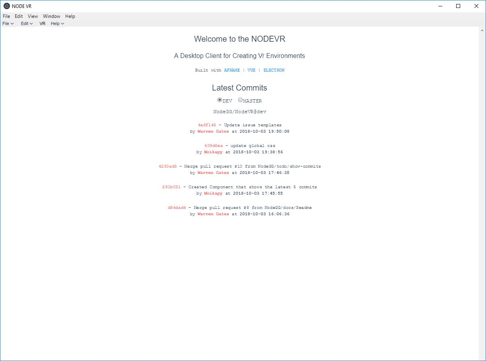
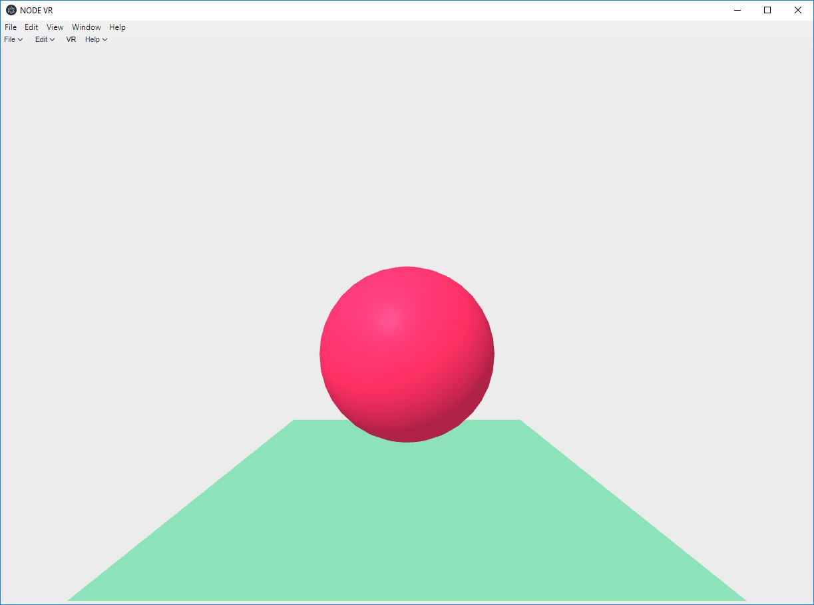

# NODE VR [](https://discord.gg/ZgDHrQa)

*Built By NodeGG  and Friends*

 

## Introduction
**NODEVR** is A Desktop Client for Creating Vr Environments. 

#### It's main features are:

(*coming soon*)


## Built With
> [AFRAME](https://aframe.io/) | [VUEJS](https://vuejs.org/) | [ELECTRON](https://electronjs.org/)


## Issues
There is a list of [Known Issues](https://github.com/NodeGG/NODEVR/issues) (things to be fixed or that aren't yet implemented).

If you found a bug or have a new idea/feature for the program, [you can report them](https://github.com/NodeGG/NODEVR/issues/new?template=nodevr-issue-template.md).
___
**TODO List**

- [ ] Create Basic Start Page.
- [ ] Create Fluid transition between start to VR Builder.
- [ ] Create way to save and load files.

## Local Development
If using Yarn (Recomended):
```
git clone git@github.com:NodeGG/NODEVR.git
cd NODEVR && npm i
yarn start
```

If using NPM
```
git clone git@github.com:NodeGG/NODEVR.git
cd NODEVR && npm i
npm start
```
## Generating Builds
If using Yarn (Recomended):
```
yarn build
```

If using NPM
```
npm run build
```
## Support
Official Channels:
- [Node GG Discord Server](https://discord.gg/ZgDHrQa)
- More Coming Soon

## Authors
- [Warren Gates](https://github.com/Moikapy): Lead developer, bug fixing, new features, designer, and maintainer.

## Credits
- [Dependencies](https://github.com/NodeGG/NODEVR/network/dependencies)
- ( *More Coming Soon* )